# 🔐 Designing and Building a Secure VPC for Production 3-Tier Architecture with Terraform

---

## Table of Contents

- [Introduction](#introduction)
- [Objective](#objective)
- [What You'll Learn](#what-youll-learn)
- [Infrastructure Overview](#infrastructure-overview)
    - [Core Components](#core-components)
- [Architecture Overview](#architecture-overview)
- [Architecture Details](#architecture-details)
    - [Network Design](#network-design)
    - [Security Features](#security-features)
    - [Routing Configuration](#routing-configuration)
    - [Amazon CloudWatch](#amazon-cloudwatch)
- [Traffic Flow](#traffic-flow)
- [High Availability](#high-availability)
    - [Multi-AZ Deployment Strategy](#multi-az-deployment-strategy)
- [Security Considerations](#security-considerations)
    - [Security Groups](#security-groups)
    - [Network ACLs](#network-acls)
    - [Flow Logs](#flow-logs)
- [Implementation](#implementation)
    - [Prerequisites Checklist](#prerequisites-checklist)
- [Project Structure](#project-structure)
- [Step-by-Step Deployment Process](#step-by-step-deployment-process)
    - [Step 1 — Configure Terraform State Backend](#step-1--configure-terraform-state-backend-s3--dynamodb)
    - [Step 2 — Configure Internet Gateway and Route Tables](#step-2--configure-internet-gateway-and-route-tables)
    - [Step 3 — Configure Security Groups](#step-3--configure-security-groups-for-least-privilege-access)
    - [Step 4 — Enable Network ACLs](#step-4--enable-network-acls-for-additional-protection)
    - [Step 5 — Apply Best Practices](#step-5--apply-best-practices)
    - [Step 6 — Set Up CI/CD Pipeline](#step-6--set-up-cicd-pipeline-with-github-actions)
- [Modules](#modules)
    - [Module: bootstrap](#module-bootstrap)
    - [Module: iam — ga-oidc.tf](#module-iam--ga-oidctf)
    - [Module: security-groups](#module-security-groups)
    - [Module: vpc](#module-vpc)
- [Quick Start](#quick-start)
- [Verification Checklist](#verification)
- [Cost Optimization](#cost-optimization)
- [Conclusion](#conclusion)

---

## Introduction

***

The networking layer is the foundation of your infrastructure. Amazon Virtual Private Cloud (VPC) is the networking
foundation of your AWS infrastructure. It provides isolated network environments where you can launch AWS resources with
complete control over IP addressing, subnets, route tables, and network gateways. While IAM controls *who* can access
your resources, VPC controls *how* resources communicate with each other and the outside world.

Think of VPC as your private data center in the cloud, but with the flexibility and scalability that traditional
networking could never provide. You can create multiple isolated networks within a single AWS account, segment them into
public and private subnets, control traffic flow with security groups and network ACLs, and connect to on-premises
networks through VPN or Direct Connect.

A well-architected VPC enables:

- Security through network isolation
- High availability through multi-AZ deployments
- Hybrid cloud connectivity
- Scalability to accommodate future growth

### Problem context

***
Your company is launching a production web application that handles sensitive user data (e.g. transactions, personal
information). The engineering team has been deploying directly into a flat, single-subnet AWS environment with no
network segmentation, all resources sharing the same security group, and no audit trail of network traffic. As the team
scales from a proof-of-concept to a production system, several critical risks surface:

* Any compromised instance can reach the database directly
* There is no isolation between the web layer and the backend logic layer
* Outbound traffic from internal servers is uncontrolled
* Compliance audits (PCI-DSS, SOC 2) require documented network boundaries and access controls
* Infrastructure is being provisioned manually through the AWS console — no repeatability, no version control, no drift
  detection



**The five core challenges built-in this project:**

1. **Network segmentation** — the "blast radius" problem. If an attacker compromises the web tier, how do you prevent
   lateral movement to the database? Your 3-tier design answers this with strict subnet isolation and security group
   rules that only allow traffic on specific ports between adjacent tiers.
2. **Egress control** — private instances shouldn't have free outbound access. NAT Gateways give you controlled,
   auditable outbound traffic, while VPC Endpoints eliminate the need to route S3 and DynamoDB calls over the public
   internet entirely.
3. **Compliance and auditability** — without NACLs, security groups scoped per tier, and VPC Flow Logs, you cannot pass
   a network security audit. The architecture provides a documented, evidenced control set.
4. **Infrastructure drift and repeatability** — manual console changes can't be reviewed, rolled back, or promoted
   across environments consistently. Terraform solves this with state-tracked, modular code and separate ```.tfvars``` per
   environment (dev/staging/prod).
5. **Shift-left security** — catching misconfigurations after deployment is expensive. The Checkov + GitHub Actions
   workflow moves security checks to pull request time, before anything reaches AWS.

## Objective

***

Automate VPC creation with Infrastructure as Code to design a **Secure VPC for a Production Web Application**. Build a
production-ready, secure and highly available VPC with complete network isolation, multi-tier architecture across 3
Availability Zones, and hybrid connectivity simulation.

Imagine you're deploying a multi-tier web application (frontend, backend, and database) in AWS. The main goals are:

| Goal                    | Description                                 |
|-------------------------|---------------------------------------------|
| 🔒 **SECURE**           | Defense-in-depth network security           |
| 📈 **SCALABLE**         | Built for growth and high availability      |
| 💰 **COST-OPTIMIZED**   | Reduce egress costs and maximize value      |
| 🏢 **ENTERPRISE-READY** | Governance, compliance and best practices   |
| ⚙️ **AUTOMATED**        | Terraform, CI/CD and Infrastructure as Code |

## What You'll Learn

***

- ✅ Production-grade VPC architecture patterns
- ✅ CIDR planning strategies and subnet design
- ✅ Public, private, and isolated subnet models
- ✅ NAT Gateway design and optimization
- ✅ Route tables and advanced routing strategies
- ✅ Security Groups and PCI-compliant NACL patterns
- ✅ VPC Endpoints and PrivateLink optimization
- ✅ Zero Trust networking principles on AWS
- ✅ Terraform Infrastructure as Code implementation
- ✅ GitHub Actions CI/CD integration
- ✅ Monitoring and observability using Flow Logs and CloudWatch

## Infrastructure Overview

***

This Terraform configuration deploys a highly available, secure AWS VPC infrastructure across multiple availability
zones.

### Core Components

| Component            | Description                                                   |
|----------------------|---------------------------------------------------------------|
| **VPC**              | Production-grade Virtual Private Cloud with DNS support       |
| **Subnets**          | Public and private subnets across multiple availability zones |
| **NAT Gateways**     | Internet connectivity for private subnets                     |
| **Internet Gateway** | Direct internet access for public subnets                     |
| **Route Tables**     | Separate routing for public and private traffic               |
| **Security Groups**  | Instance-level firewall rules                                 |
| **VPC Endpoints**    | Gateway endpoints for S3 and DynamoDB services                |
| **Network ACLs**     | Additional network-level security                             |
| **Flow Logs**        | VPC traffic monitoring and logging                            |

## Architecture Overview

***

```
VPC: 10.0.0.0/16
├── Public Tier (Web)
│   ├── 10.0.1.0/24   (us-east-1a)
│   ├── 10.0.2.0/24   (us-east-1b)
│   └── 10.0.3.0/24   (us-east-1c)
├── Application Tier (Private)
│   ├── 10.0.11.0/24  (us-east-1a)
│   ├── 10.0.12.0/24  (us-east-1b)
│   └── 10.0.13.0/24  (us-east-1c)
└── Database Tier (Private)
    ├── 10.0.21.0/24  (us-east-1a)
    ├── 10.0.22.0/24  (us-east-1b)
    └── 10.0.23.0/24  (us-east-1c)
```


## Architecture Details

***

### Network Design

| Parameter                  | Value                                                               |
|----------------------------|---------------------------------------------------------------------|
| **CIDR**                   | `10.0.0.0/16`                                                       |
| **Public Subnets**         | `10.0.1.0/24` (AZ-a), `10.0.2.0/24` (AZ-b), `10.0.3.0/24` (AZ-c)    |
| **Private Subnets (App)**  | `10.0.11.0/24` (AZ-a), `10.0.12.0/24` (AZ-b), `10.0.13.0/24` (AZ-c) |
| **Private Subnets (Data)** | `10.0.21.0/24` (AZ-a), `10.0.22.0/24` (AZ-b), `10.0.23.0/24` (AZ-c) |
| **NAT Gateways**           | 3 (one per AZ for high availability)                                |
| **Multi-AZ**               | Resources span 3 availability zones                                 |

**Public Subnets** host resources that need direct internet access (load balancers, bastion hosts).  
**Private Subnets** host internal resources (application servers, databases).

### Security Features

- **Network ACLs** — Additional layer of security at the subnet level
- **Security Groups** — Instance-level firewall rules
- **Flow Logs** — Monitor and log VPC traffic for security analysis
- **VPC Endpoints** — Secure access to AWS services without internet routing

### Routing Configuration

- **Public Route Table** — Routes internet traffic through the Internet Gateway
- **Private Route Tables** — Routes internet traffic through NAT Gateways (one per AZ)

### Amazon CloudWatch

- **Logs** — Centralized logging for all services (retention: 30 days)
- **Metrics** — Custom metrics for business KPIs
- **Dashboards** — Real-time operational visibility

## Traffic Flow

***


1. **Inbound** — Users hit the Internet Gateway, which forwards traffic to the Application Load Balancer in the public
   subnets across all three AZs.
2. **Application tier** — The ALB distributes requests to the private application subnets (`10.0.11–13.0/24`). These
   servers handle business logic.
3. **Data tier** — App servers query databases/caches in the private data subnets (`10.0.21–23.0/24`). No direct
   internet access here.
4. **Outbound** — The private app tier routes outbound traffic (package downloads, API calls) back through the NAT
   Gateways in the public subnets, which exit via the IGW.
5. **CI/CD** — GitHub pushes trigger GitHub Actions, which deploys directly to AWS infrastructure.

## High Availability

***

### Multi-AZ Deployment Strategy

| Layer             | Strategy                                                                |
|-------------------|-------------------------------------------------------------------------|
| **Compute**       | Distributed across 3 AZs (us-east-1a, 1b, 1c)                           |
| **Database**      | Primary in AZ-a, replicas in AZ-b and AZ-c with auto-failover (30–120s) |
| **Load Balancer** | ALB with cross-zone load balancing enabled                              |
| **NAT Gateways**  | 3 NAT Gateways (one per AZ) to eliminate single points of failure       |

## Security Considerations

***

> ⚠️ **Important:** Review and customize all security rules before production deployment.

### Security Groups

| Security Group | Inbound              | Outbound                                                         |
|----------------|----------------------|------------------------------------------------------------------|
| **ALB-SG**     | 443 from `0.0.0.0/0` | 8080 to ECS-SG                                                   |
| **APP-SG**     | 8080 from ALB-SG     | 443 (all), 5432 (DATA-SG), 9200 (OpenSearch-SG), 6379 (Cache-SG) |
| **DATA-SG**    | 5432 from APP-SG     | None                                                             |

> ⚠️ The default security group is configured with open rules (`0.0.0.0/0`). **Modify this before production use.**

### Network ACLs

| Subnet              | Rule                                           |
|---------------------|------------------------------------------------|
| **Public subnets**  | Allow 80, 443 inbound; ephemeral outbound      |
| **Private subnets** | Deny all inbound from internet; allow VPC CIDR |
| **Data subnets**    | Deny all except from application subnet CIDR   |

### Flow Logs

Logs are retained for **30 days**. Adjust the retention period as needed for your compliance requirements.

## Implementation

***

### Prerequisites Checklist

- [ ] AWS account with VPC creation permissions
- [ ] AWS CLI installed and configured
- [ ] Terraform installed (version `>= 1.0`)
- [ ] State management: S3 backend with DynamoDB state locking
- [ ] Understanding of AWS networking concepts
- [ ] Review of security group and NACL rules
- [ ] Modular structure: VPC, bootstrap, monitoring module
- [ ] Environment management: Workspaces for dev/staging/prod
- [ ] CI/CD Platform: GitHub Actions (free for public repos, integrated with AWS OIDC)

## Project Structure

```
secure-vpc-for-three-tier-web-app/
├── AWS services study note             # AWS services study note
├── Documentation/                      # Project documentation
├── modules/
│   ├── bootstrap/                      # Remote state backend setup
│   │   ├── main.tf
│   │   ├── outputs.tf
│   │   └── variables.tf
│   ├── iam/                            # IAM roles for this project
│   │   ├── ga-oidc.tf                  # GitHub Actions CI/CD using OIDC
│   │   ├── outputs.tf
│   │   └── variables.tf
│   └── vpc/                            # VPC module
│       ├── main.tf
│       ├── outputs.tf
│       └── variables.tf
├── Screenshot verification/            # Post-deployment verification screenshots
├── .gitignore
├── backend.tf                          # Terraform state backend configuration
├── data.tf                             # Data sources
├── locals.tf                           # Common tags
├── main.tf                             # Main infrastructure resources
├── outputs.tf                          # Output values
├── dev-terraform.tfvars                # Variables for dev environment
├── staging-terraform.tfvars            # Variables for staging environment
├── prod-terraform.tfvars               # Variables for prod environment
├── providers.tf                        # Terraform and AWS provider configuration
├── variables.tf                        # Input variables and defaults
└── .github/workflows/
    ├── website-deployment.yml          # Static website deployment workflow
    └── terraform-checkov.yml           # Checkov security scanning workflow
```

## Step-by-Step Deployment Process

***

### Step 1 — Configure Terraform State Backend (S3 + DynamoDB)

Use a non-overlapping CIDR block (`10.0.0.0/16`) to ensure no conflicts with future on-premises VPN connections.

- Create **Public and Private Subnets** in multiple AZs
    - Public subnet for Load Balancers & Bastion Host
    - Private subnet for Application Servers & Databases
- Enable **DNS Hostnames** for the VPC (required for Route 53 & public IPs)

### Step 2 — Configure Internet Gateway and Route Tables

- Attach an **Internet Gateway** for public subnets
- Create a **Route Table** for the public subnet to enable internet access
- Create a **Private Route Table** for internal traffic
- Use **NAT Gateway** for private subnets to restrict direct internet access

### Step 3 — Configure Security Groups for Least Privilege Access

**Load Balancer Security Group** (Public Access)

- Allow HTTP (80) and HTTPS (443) from anywhere
- Allow only outbound traffic to backend instances (app tier)

**Application Server Security Group** (Private Access)

- Only accept traffic from the ALB-SG
- Block all direct inbound traffic

**Database Security Group** (Isolated Access)

- Accept traffic only from APP-SG
- Deny all external access

### Step 4 — Enable Network ACLs for Additional Protection

- Block SSH (22) from untrusted sources
- Allow HTTP & HTTPS for public subnets

### Step 5 — Apply Best Practices

By implementing these steps, we achieve:

- ✅ Secure VPC design with public/private subnets
- ✅ Least privilege access with security groups & IAM
- ✅ Logging and monitoring with CloudTrail & VPC Flow Logs
- ✅ Network ACLs to enforce additional restrictions

### Step 6 — Set Up CI/CD Pipeline with GitHub Actions

#### Required GitHub Secrets

Go to **Settings → Secrets and variables → Actions** in your fork:

| Secret                 | Description                    |
|------------------------|--------------------------------|
| `AWS_REGION`           | `us-east-1`                    |
| `AWS_ROLE_ARN`         | Your `github-actions-role` ARN |
| `TF_BACKEND_S3_BUCKET` | Your state bucket name         |
| `TF_VERSION`           | `1.14.8`                       |

#### Workflow Files

- **`terraform-checkov.yml`** — Automated security scanning using Checkov to detect Terraform misconfigurations at
  repository and PR levels.
- **`deploy-infrastructure.yml`** — Terraform workflow to provision infrastructure and deploy a secure VPC with OIDC.

## Modules

***

### Module: `bootstrap`

Sets up the **remote state backend infrastructure** for Terraform — run once before using remote state.

**The Problem It Solves:** By default, Terraform stores state locally. In a team or CI/CD environment, state must be
stored remotely and protected.

| Resource                                             | Purpose                                                    |
|------------------------------------------------------|------------------------------------------------------------|
| `aws_s3_bucket.terraform_state`                      | Stores `.tfstate` files                                    |
| `aws_s3_bucket_versioning`                           | Enables versioning; preserves previous states for rollback |
| `aws_s3_bucket_server_side_encryption_configuration` | Encrypts state at rest using AWS KMS                       |
| `aws_s3_bucket_public_access_block`                  | Blocks all public access (hard override)                   |
| `aws_dynamodb_table.terraform_locks`                 | State locking — prevents simultaneous apply corruption     |

**How They Work Together:**

```
terraform apply
      │
      ▼
Reads state ◄── S3 bucket (versioned + encrypted + private)
      │
      ▼
Acquires lock ──► DynamoDB table (LockID)
      │
      ▼
Makes changes
      │
      ▼
Writes new state ──► S3 bucket
      │
      ▼
Releases lock ──► DynamoDB (deletes LockID row)
```

### Module: `iam` — `ga-oidc.tf`

Sets up **GitHub Actions CI/CD authentication to AWS using OIDC** (OpenID Connect) — a keyless, token-based auth method.
No long-lived AWS credentials are stored in GitHub secrets.

**Overall Flow:**

```
GitHub Actions job starts
      │
      ▼
GitHub issues a signed OIDC JWT token
      │
      ▼
Workflow calls sts:AssumeRoleWithWebIdentity with that token
      │
      ▼
AWS verifies the token against the registered OIDC provider
      │
      ▼
AWS checks repo/org conditions match
      │
      ▼
AWS returns short-lived credentials (max 1h)
      │
      ▼
Terraform runs with those credentials
```

### Module: `security-groups`

Defines the **network security boundary** for a classic three-tier AWS architecture — web, application, and database —
plus a bastion host for administrative access.

```
VPC
 │
 ├── Internet  :80/:443
 │       │
 │   web-tier-sg  (ingress: 0.0.0.0/0 → :80, :443)
 │       │
 │   var.app_port        :22 (bastion)
 │       │                  │
 │   app-tier-sg  ◄─────────┤  bastion-sg
 │       │                     (ingress: bastion_cidr → :22)
 │   var.db_port         :22 (bastion)
 │       │
 │   db-tier-sg  (ingress: app-sg → db_port, bastion-sg → :22)
```

| Security Group                                  | Description                                                                          |
|-------------------------------------------------|--------------------------------------------------------------------------------------|
| **Web tier** (`aws_security_group.web`)         | Only SG accepting traffic from the public internet (80/443).                         |
| **App tier** (`aws_security_group.app`)         | Accepts traffic only from the web tier SG — not the internet directly.               |
| **DB tier** (`aws_security_group.db`)           | Only accepts connections from the app tier SG. Completely unreachable from internet. |
| **Bastion host** (`aws_security_group.bastion`) | SSH (port 22) only from a restricted CIDR (office IP or `/32`).                      |

> **Security model in one sentence:** Internet traffic enters only through the web tier → app servers are reachable only
> from the web tier → databases are reachable only from app servers → SSH into private tiers requires the bastion,
> locked
> to a specific IP range.

### Module: `vpc`

Builds the **three-tier AWS VPC network** — a classic production-grade architecture.

```
Internet
    │
    ▼
Internet Gateway
    │
    ▼
┌─────────────────────────────────────────┐
│  VPC                                    │
│  Public subnets (Web tier) — per AZ     │
│   AZ-A           AZ-B           AZ-C   │
│  NAT GW + EIP   NAT GW + EIP   NAT GW  │
│                                         │
│  App subnets (Private) — per AZ         │
│   AZ-A           AZ-B           AZ-C   │
│  RT → NAT-A     RT → NAT-B    RT → NAT-C│
│                                         │
│  DB subnets (Private) — per AZ          │
│   AZ-A           AZ-B           AZ-C   │
│                                         │
│  Public NACL    VPC Endpoints  Flow Logs│
│  HTTP/HTTPS     S3+DynamoDB    7-day    │
│  SSH/ephem.     (free GW)      retention│
└─────────────────────────────────────────┘
```

| Block                             | Description                                                                                  |
|-----------------------------------|----------------------------------------------------------------------------------------------|
| **VPC & Internet Gateway**        | Foundation — IGW connects public subnets to the internet.                                    |
| **Three subnet tiers**            | Public (Web), App (Private), DB (Private) across each AZ.                                    |
| **Elastic IPs + NAT Gateways**    | One NAT GW per AZ. Private → NAT GW → IGW → Internet.                                        |
| **Route Tables**                  | One public (all public subnets → IGW); one private per AZ (→ that AZ's NAT GW).              |
| **Network ACL (Public)**          | Stateless firewall. Allows 80, 443, SSH (restricted CIDR), ephemeral ports (1024–65535).     |
| **VPC Endpoints (S3 + DynamoDB)** | Free gateway endpoints. Private subnet traffic to S3/DynamoDB stays within AWS — saves cost. |
| **VPC Flow Logs**                 | Captures all traffic metadata. Stored in CloudWatch Logs with 7-day retention.               |

> The overall design follows AWS best practices: **multi-AZ for resilience**, **least-privilege routing**, and **free
egress optimization** via Gateway endpoints.

## Quick Start

***

### Step 1 — Fork and Clone

```bash
git clone https://github.com/darvin-rakotomalala/secure-vpc-for-three-tier-web-app
cd secure-vpc-for-three-tier-web-app
```

### Step 2 — Configure Terraform

Edit `dev-terraform.tfvars` to match your target region and preferences. No secrets go here — just region, domain name,
and default tags.

### Step 3 — Deploy Infrastructure

```bash
cd secure-vpc-for-three-tier-web-app
terraform init
terraform plan -var-file="dev-terraform.tfvars" -no-color -out=TFplan.JSON
terraform apply -var-file="dev-terraform.tfvars" -auto-approve
```

## Verification

***

After successfully deployment, verify the following resources in the AWS Console:

- **Outputs**


- **VPC**


- **Internet Gateway**


- **Subnets**


- **Elastic IPs**


- **NAT Gateways**


- **Route Tables**


- **Network ACL**


- **VPC Endpoints**


- **VPC Flow Logs**


- **Security Groups**


## Cost Optimization

***

| Feature           | Optimization                                                              |
|-------------------|---------------------------------------------------------------------------|
| **NAT Gateways**  | One per AZ (consider NAT instances for dev/non-prod environments)         |
| **VPC Endpoints** | Reduce data transfer costs for S3 and DynamoDB access (free gateway type) |
| **Flow Logs**     | 30-day retention balances monitoring needs with storage costs             |

## Conclusion

***

In this project, we walked through deploying a **production-grade secure Virtual Private Cloud (VPC)** on AWS using
Terraform — provisioning:

- VPC, Subnets, NAT Gateways, Internet Gateway
- Route Tables, Security Groups
- VPC Endpoints, Network ACLs, Flow Logs

All deployment is automated through **GitHub Actions CI/CD** with OIDC-based keyless authentication.

---

_Project by Darvin | Secure VPC for Production 3-Tier Architecture_
