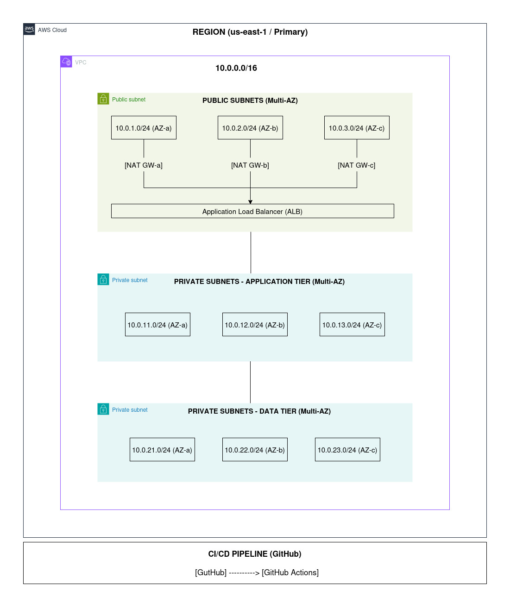

## Designing and Building a Secure VPC for Production 3-Tier Architecture using Terraform

Automate VPC creation with Infrastructure as Code to design a Secure VPC for a Production Web Application. Build a
production-ready, secure and highly available VPC with complete network isolation, multi-tier architecture across 3
Availability Zones, and hybrid connectivity simulation.

Imagine you're deploying a multi-tier web application (frontend, backend, and database) in AWS.
The main goal is:

* **Secure** : Defense-in-depth network security
* **Scalable** : Built for growth and high availability
* **Cost-Optimized** : Reduce egress costs and maximize value
* **Enterprise-ready** : Governance, compliance and best practices
* **Automated** : Terraform, CI/CD and Infrastructure as Code

**What You’ll Learn**

* ✔️ Production-grade VPC architecture patterns
* ✔️ CIDR planning strategies and subnet design
* ✔️ Public, private, and isolated subnet models
* ✔️ NAT Gateway design and optimization
* ✔️ Route tables and advanced routing strategies
* ✔️ Security Groups and PCI-compliant NACL patterns
* ✔️ VPC Endpoints and PrivateLink optimization
* ✔️ Zero Trust networking principles on AWS
* ✔️ Terraform Infrastructure as Code implementation
* ✔️ GitHub Actions CI/CD integration
* ✔️ Monitoring and observability using Flow Logs and CloudWatch

### Architecture Overview

***

This Terraform configuration deploys a highly available, secure AWS VPC infrastructure across multiple availability
zones with the following components:

**Core Components**

* **VPC**: Production-grade Virtual Private Cloud with DNS support
* **Subnets**: Both public and private subnets across multiple availability zones
* **NAT Gateways**: Internet connectivity for private subnets
* **Internet Gateway**: Direct internet access for public subnets
* **Route Tables**: Separate routing for public and private traffic
* **Security Groups**: Default security group with permissive rules
* **VPC Endpoints**: Gateway endpoints for S3 and DynamoDB services
* **Network ACLs**: Additional network-level security
* **Flow Logs**: VPC traffic monitoring and logging

### Architecture Diagram

**Architecture Overview**

**VPC: 10.0.0.0/16**

* Public Tier (Web):

```
* 10.0.1.0/24 (us-east-1a)
10.0.2.0/24 (us-east-1b)
10.0.3.0/24 (us-east-1c)
```

* Application Tier:

```
10.0.11.0/24 (us-east-1a)
10.0.12.0/24 (us-east-1b)
10.0.13.0/24 (us-east-1c)
```

* Database Tier:

```
10.0.21.0/24 (us-east-1a)
10.0.22.0/24 (us-east-1b)
10.0.23.0/24 (us-east-1c)
```



### Architecture Details

**Network Design**

* CIDR: 10.0.0.0/16

**Public Subnets**: Host resources that need direct internet access (load balancers, bastion hosts)

* Public Subnets: 10.0.1.0/24 (AZ-a), 10.0.2.0/24 (AZ-b), 10.0.3.0/24 (AZ-c)

**Private Subnets**: Host internal resources (application servers, databases)

* Private Subnets (App): 10.0.11.0/24 (AZ-a), 10.0.12.0/24 (AZ-b), 10.0.13.0/24 (AZ-c)
* Private Subnets (Data): 10.0.21.0/24 (AZ-a), 10.0.22.0/24 (AZ-b), 10.0.23.0/24 (AZ-c)
* NAT Gateways: 3 (one per AZ for high availability)
* Multi-AZ Deployment: Resources span multiple availability zones for high availability

**Security Features**

* Network ACLs: Additional layer of security at the subnet level
* Security Groups: Instance-level firewall rules
* Flow Logs: Monitor and log VPC traffic for security analysis
* VPC Endpoints: Secure access to AWS services without internet routing

**Routing Configuration**

* Public Route Table: Routes internet traffic through Internet Gateway
* Private Route Tables: Routes internet traffic through NAT Gateways (one per AZ)

### Traffic Flow

***



Here's the traffic flow derived from the architecture diagram. The path goes:

1. **Inbound** — Users hit the Internet Gateway, which forwards traffic to the Application Load Balancer sitting in the
   public subnets across all three AZs.
2. **Application tier** — The ALB distributes requests down to the private application subnets (10.0.11–13.0/24). These
   servers handle your business logic.
3. **Data tier** — The app servers query the databases/caches in the private data subnets (10.0.21–23.0/24). No direct
   internet access here.
4. **Outbound (dashed lines)** — The private app tier routes outbound traffic (e.g. for package downloads or API calls)
   back up through the NAT Gateways in the public subnets, which then exit via the IGW.
5. **CI/CD** — GitHub pushes trigger GitHub Actions, which deploys directly to your AWS infrastructure.

### Implementation

***
**Step 1: Project Structure**

```
secure-vpc-for-three-tier-web-app/
├── AWS services study note         # AWS services study note
├── Documentation                   # Documentation of this project
└── modules/
    └── bootstrap/                  # This module sets up a backend for Terraform state file
          ├── main.tf
          ├── outputs.tf
          └── variables.tf
    └── iam/                        # This module creates an IAM for this project
          ├── ga-oidc.tf            # This code sets up IAM role Terraform execution ARN for GitHub Actions CI/CD using OIDC (OpenID Connect)
          ├── outputs.tf
          └── variables.tf
    └── vpc/                        # This module sets up a VPC
          ├── main.tf
          ├── outputs.tf
          └── variables.tf
   ├── Screenshot verification      # Screenshot verification after success deployment
   ├── .gitignore                   # gitignore
   ├── backend.tf                   # Backend configuration for Terraform state file
   ├── data.tf                      # Data sources
   ├── locals.tf                    # locals for common_tags
   ├── main.tf                      # Main infrastructure resources
   ├── outputs.tf                   # Output values
   ├── dev-terraform.tfvars         # The terraform.tfvars file for dev
   ├── staging-terraform.tfvars     # The terraform.tfvars file for staging
   ├── prod-terraform.tfvars        # The terraform.tfvars file for prod
   ├── providers.tf                 # Terraform and AWS provider configuration
   ├── variables.tf                 # Input variables and defaults
   ├── .github/workflows/
      ├── website-deployment.yml    # Static Website deployment workflows
      ├── terraform-checkov.yml     # Checkov workflows
```

**Step 2: Modules**

- Module "bootstrap"
- Module "iam"
- Module "vpc"
    - Create VPC + DNS flags ```aws_vpc.main```
    - Internet Gateway + attach ```aws_internet_gateway.main```
    - 9 subnets (public/app/db × 3 AZs) ```aws_subnet.public/app/db``` (count loops)
    - 3 EIPs + NAT Gateways ```aws_eip.nat```, ```aws_nat_gateway.main```
    - 1 public RT + 3 private RTs ```aws_route_table.public/private``` + associations
    - 4 Security Groups + ingress rules ```aws_security_group.web/app/db/bastion``` + ```aws_security_group_rule```
    - Public NACL + inbound/outbound rules ```aws_network_acl.public```
    - S3 + DynamoDB Gateway Endpoints ```aws_vpc_endpoint.s3/dynamodb```

**A few key design decisions:**

* ```count``` **loops** replace the repetitive AZ-by-AZ CLI blocks — subnets, NAT gateways, EIPs, and private route
  tables all scale automatically if you add a 4th AZ.
* **SSH bastion rules** (```aws_security_group_rule```) are separated from the main SG blocks to avoid Terraform
  circular dependency issues between the app/db/bastion groups.
* ```bastion_allowed_cidr``` defaults to the ```203.0.113.0/24``` from the source — change this to your real IP before
  applying.

**Step 3: Outputs**<br>
After successful deployment, the following outputs will be available:

- ```vpc_id``` — ID of the created VPC
- ```public_subnets``` — List of public subnet IDs
- ```private_subnets``` — List of private subnet IDs
- ```nat_gateways``` — List of NAT Gateway IDs
- ```internet_gateway``` — Internet Gateway ID
- ```vpc_cidr``` — CIDR block of the VPC


**Step 4: Deployment Workflow**

- ```terraform-checkov.yml``` — Automated security scanning framework using Checkov to detect Terraform
  misconfigurations at both repository and pull request (PR) levels.
- ```deploy-infrastructure.yml``` — Terraform workflow to provision infrastructure and deploy a production-grade secure
  Virtual Private Cloud (VPC) on AWS — provisioning VPC, Subnets, NAT Gateways, Internet Gateway, Route
  Tables, Security Groups, VPC Endpoints, Network ACLs and Flow Logs.

### Quick Start

***

- **Step 1 — Fork and clone**
    - $ git clone https://github.com/darvin-rakotomalala/secure-vpc-for-three-tier-web-app
    - $ cd secure-vpc-for-three-tier-web-app

- **Step 2 — Configure Terraform**<br>
  Edit ```secure-vpc-for-three-tier-web-app/dev-terraform.tfvars``` to match your target region and preferences. No
  secrets go here — just region, domain name, and default tags.

- **Step 3 — Deploy infrastructure**

  ```
  $ cd secure-vpc-for-three-tier-web-app
  $ terraform init
  $ terraform fmt -recursive
  $ terraform validate
  $ terraform plan -var-file="dev-terraform.tfvars" -no-color -out=TFplan.JSON
  $ terraform apply -var-file="dev-terraform.tfvars" -auto-approve
  ```
  **Migration to remote backen**

  - Add or activate backend configuration : ```backend.tf```
  - Reinitialize to migrate state: ```terraform init -migrate-state```

### Verification

***
You can check the full documentation in ```Documentation``` directory and all screenshot in
```Screenshot verification```.

- Create VPC

  IMG

- Create Internet Gateway

  IMG

- Create Subnets

  IMG

- Create NAT Gateways

  IMG

- Create Route Tables

  IMG

- Create Security Groups

  IMG

- Create Network ACLs (Additional Layer)

  IMG

- Create VPC Endpoints

  IMG

- Enabling VPC Flow Logs

  IMG

### Cleanup

***
To destroy all resources, run ```terraform destroy -var-file="dev-terraform.tfvars" -auto-approve```

### License

***
This project is provided as-is for educational and production use.
